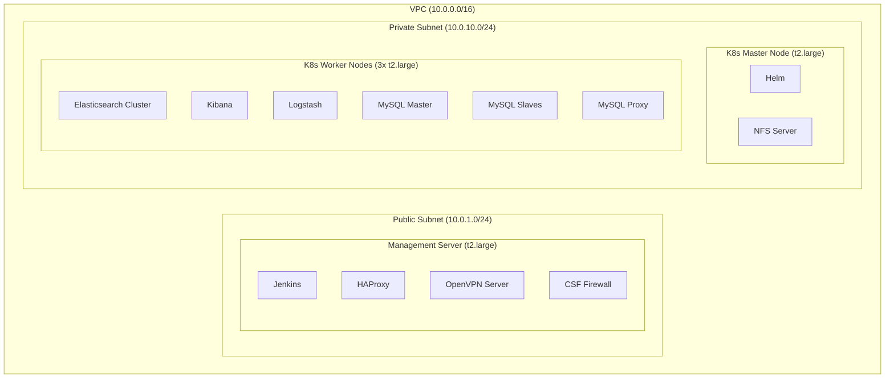

# WordPress Application Cluster on K3s

This project demonstrates deploying a scalable WordPress application cluster using K3s, a lightweight Kubernetes distribution, on AWS infrastructure. It utilizes Terraform for infrastructure provisioning and Ansible for configuration management and application deployment.

## Table of Contents

- [WordPress Application Cluster on K3s](#wordpress-application-cluster-on-k3s)
  - [Table of Contents](#table-of-contents)
  - [Project Overview](#project-overview)
  - [Project Structure](#project-structure)
  - [Architecture](#architecture)
    - [Model](#model)
    - [Infrastructure (AWS)](#infrastructure-aws)
    - [Application Stack](#application-stack)
  - [Prerequisites](#prerequisites)
  - [Deployment Steps](#deployment-steps)
    - [1. Set Up AWS Infrastructure](#1-set-up-aws-infrastructure)
    - [2. Configure Ansible Inventory](#2-configure-ansible-inventory)
    - [3. Set up Secrets for Database](#3-set-up-secrets-for-database)
    - [4. Install Required Ansible Collections](#4-install-required-ansible-collections)
    - [5. Deploy K3s Cluster and Applications](#5-deploy-k3s-cluster-and-applications)
  - [Components Explained](#components-explained)
  - [Security Considerations](#security-considerations)
  - [Enhancements](#enhancements)
  - [Debugging](#debugging)
  - [References](#references)

## Project Overview

This project aims to create a robust, scalable WordPress deployment using modern DevOps practices and tools. It leverages:

- Terraform for infrastructure as code (IaC)
- Ansible for configuration management and application deployment
- K3s for a lightweight Kubernetes environment
- HAProxy for load balancing
- MySQL with replication for data persistence
- NGINX Ingress Controller for routing

The result is a WordPress cluster that can handle high traffic loads and provides improved reliability through component redundancy.

## Project Structure
```
.
├── ansible
│   ├── group_vars
│   │   ├── all.yml
│   │   ├── vault.yml
│   │   ├── master.yml
│   │   └── worker.yml
│   ├── inventory
│   │   └── hosts.yml
│   ├── roles
│   ├── ansible.cfg
│   └── site.yml
├── aws-terraform-infrastructure
│   ├── keys
│   ├── modules
│   ├── terraform.lock.hcl
│   ├── main.tf
│   ├── outputs.tf
│   └── variable.tf
├── images
├── .gitignore
└── README.md
```

## Architecture

### Model


### Infrastructure (AWS)

- VPC with public subnets
- Internet Gateway for public internet access
- Security groups for access control
- EC2 instances (1 master, 1 worker) in public subnets
- Elastic IPs for stable public addressing



### Application Stack

- **Load Balancer Layer**: HAProxy for distributing incoming traffic
- **Application Layer**: WordPress deployments running on K3s
- **Data Layer**: MySQL StatefulSet with primary-replica replication
- **Storage**: NFS Server for shared filesystem (WordPress media, etc.)
- **Ingress**: NGINX Ingress Controller for routing and SSL termination

## Prerequisites

Before you begin, ensure you have the following installed:

- AWS CLI configured with appropriate credentials
- Terraform (version 0.14+)
- Ansible (version 2.9+)

## Deployment Steps

### 1. Set Up AWS Infrastructure

```bash
cd aws-terraform-infrastructure/
terraform init
terraform plan
terraform apply
```
Take note of the output values, as they'll be needed for Ansible configuration. Example: 
 ```bash
  {
    "dns_names" = [
      "ec2-54-224-69-231.compute-1.amazonaws.com",
    ]
    "public_ips" = [
      "54.224.69.231",
    ]
  },
```

### 2. Configure Ansible Inventory
Update the `./ansible/group_vars/all.yml` file with the information from Terraform output:
```yaml
---
instances:
  - name: "management-server-instance-0"
    private_ip: "10.0.1.10"
    public_ips: "54.224.69.231" # Replace by `public_ips`
    dns_name: "ec2-54-224-69-231.compute-1.amazonaws.com" # Replace by `dns_names`
...
```
### 3. Set up Secrets for Database
In terminal, create encrypted passwords file:
```bash
ansible-vault create group_vars/vault.yml
```
Add the following content:
```yml
vault_mysql_root_password: "123456@Za"
vault_mysql_password: "123456@Za"
vault_mysql_slave_password: "123456@Za"
```
*Note: Replace these passwords with strong, secure passwords in production.*  

To edit content in vault, using command:
```bash
ansible-vault edit group_vars/vault.yml
```

### 4. Install Required Ansible Collections
```bash
ansible-galaxy collection install community.general
ansible-galaxy collection install kubernetes.core
```

### 5. Deploy K3s Cluster and Applications
```bash
cd ../ansible/
ansible-playbook site.yml --ask-vault-pass
```
This playbook will:
- Install K3s on master and worker nodes
- Deploy HAProxy load balancer
- Set up MySQL replication
- Deploy WordPress
- Configure NGINX Ingress Controller

## Components Explained

- **HAProxy**: Acts as the entry point, distributing traffic across WordPress pods.
- **WordPress Deployment**: Scalable WordPress instances.
- **MySQL StatefulSet**: Provides a primary-replica setup for data persistence and high availability.
- **NFS Server**: Offers shared storage for WordPress media files.
- **NGINX Ingress**: Manages external access to services, including SSL/TLS termination.

## Security Considerations
While this project demonstrates core concepts, it's important to note that additional security measures should be implemented for production use, including:

- Proper network segmentation (use of private subnets)
- Implementing a bastion host for secure SSH access
- Enhancing EC2 instance security
- Implementing proper secrets management
- Regular security audits and updates

## Enhancements

- **Private Subnet for MySQL**: Move the MySQL database into a private subnet for improved security, preventing direct internet access.
- **Monitoring System**: Implement monitoring tools like Prometheus and Grafana to track infrastructure and application performance.
- **Logging**: Centralize application and infrastructure logs using ELK stack (Elasticsearch, Logstash, Kibana).
- **Backup Strategy**: Set up automated backups for MySQL and WordPress data, stored in an S3 bucket for disaster recovery.
- **Scalability**: Expand the cluster to support more WordPress instances and database replicas as traffic grows.

## Debugging
When you encounter an error and need to rerun the playbook:
1. Using ```--start-at-task```: Rerun from the failed task. Example:
   ```bash
   ansible-playbook site.yml --start-at-task="Generate client configuration files" --ask-vault-pass
   ```
2. Use --limit to run only on the failed host. Example:
   ```bash
   ansible-playbook site.yml --limit dev-master-1 --ask-vault-pass
   ```

## References

[Install a Kubernetes cluster with K3s](https://viblo.asia/p/k3s-la-gi-cai-dat-mot-cum-kubernetes-cluster-voi-k3s-gAm5yD7Xldb)  
[Install the NFS server and NFS dynamic provisioning on Azure virtual machines](https://medium.com/@shatoddruh/kubernetes-how-to-install-the-nfs-server-and-nfs-dynamic-provisioning-on-azure-virtual-machines-e85f918c7f4b)  
[Run a Replicated Stateful Application](https://kubernetes.io/docs/tasks/run-application/run-replicated-stateful-application/)  
[Deploying WordPress and MySQL with Persistent Volumes](https://kubernetes.io/docs/tutorials/stateful-application/mysql-wordpress-persistent-volume/)  
[Self Signed certificate and Use them in Haproxy and Allow certificate in MacOS](https://sharmank.medium.com/self-signed-certificate-and-use-them-in-haproxy-and-allow-certificate-in-macos-26c3aad316bb)  
